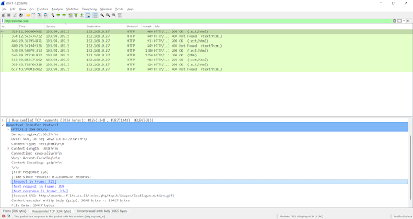

# Jarkom-Modul-1-ITA10-2022
Laporan Resmi praktikum Jarkom kelompok ITA10
 
Berikut adalah Dokumentasi dan langkah pengerjaan untuk laporan resmi praktikum jarkom modul 1

 
 
1. Dengan menggunakan display filter http.response.code kita bisa mendapatkan response dari protokol http kemudian terdapat beberapa informasi seperti Server dan HTTP response tersebut merupakan respons dari Request URL yang mana. 

Dari response diatas dapat dilihat bahwa Web server dari monta merupakan: nginx/1.10.3
 
 
2. Menggunakan http.request.uri contains “detail”, dari filter tersebut kita bisa mendisplay request http yang memiliki string “detail”.

Kemudian buka full url di web browser 

Maka didapat judul TA yang dibuka oleh Ishaq adalah 
Evaluasi unjuk kerja User Space Filesystem (FUSE)
 
 
3. Dalam Soal 3-6, telah diberikan file dengan format .pcapng pada sebuah google drive. Untuk membukanya, harus memiliki wireshark yang telah terinstall pada pc. lalu hanya perlu open file saja pada wireshark nya Menggunakan tcp.dstport == 80, dari situ kita bisa mendisplay hasil filter paket dengan protokol tcp yang menuju port 80. Dengan penanda ‘dst’ sebagai destination yang berarti tujuan.

 
 
4. Menggunakan tcp.srcport == 21. berbeda dengan nomor 3, ‘src’ mengambil dari source dari port tertentu.

  
5. Menggunakan udp.srcport == 443 dan tcp.srcport == 443, disini saya menggunakan kedua jenis protocol karena terdapat 2 jenis protocol yang tersedia dari source port yang sama yaitu 443.

 
 
6. Untuk mencari ip dari lipi.go.id dibutuhkan untuk melakukan ping pada command prompt dengan “ping <nama domain>”. Dibutuhkan beberapa saat dalam melakukan ping dan bahkan bisa timed out.

Setelah itu, untuk mendisplay packet yang menuju lipi.go.id dapat dilakukan:ip.dst == 203.160.128.158 yang berarti display paket menuju ke ip tersebut, yaitu ip milik lipi.go.id
  
 
 
7. Untuk mencari ip sendiri dapat dilihat dengan menggunakan ipconfig pada command prompt dan mencari IPv4 Address pada wifi, disini saya telah menemukan bahwa ip dari wifi saya adalah 192.168.1.4

Setelah itu untuk mengambil paket dari ip sendiri, dapat membuka wireshark Wi-Fi 2 dan langsung menggunakan ip.src == 192.168.1.4

 
 
8. Pertama-tama melakukan analisis paket dan protokol yang digunakan pada resource file, kemudian didapati informasi bahwa chat berlangsung pada protokol tcp dan flags [PSH, ACK]. Kemudian dilakukan filtering tcp && tcp.flags.push == 1

Kemudian didapatkan stream index: 12. Kemudian dilakukan follow tcp stream yang stream indexnya 12.

 
 
9. Didapatkan indikasi bahwa pertukaran file diadakan di TCP port 9002, dilakukan filtering tcp.port == 9002 dan didapatkan display berikut

Kemudian dilakukan tcp follow stream untuk mengesave file as raw 

 
 
10. Dengan menggunakan openssl, dapat dimasukkan password lalu akan muncul flag yang tersedia pada file yang telah disave. 
Password ditemukan dengan social engineering:

Flag akan segera terlihat setelah memasukkan password, Flagnya adalah JaRkOm2022{8uK4N_CtF_K0k_h3h3h3}

 
 
KESULITAN YANG DIALAMI:
- Kesulitan mencari command yang tepat pada wireshark untuk membedakan paket yang menuju dari - dan paket yang datang dari -. Kesulitan dapat disolve dengan searching.
- Kesulitan mencari password untuk membuka flag
